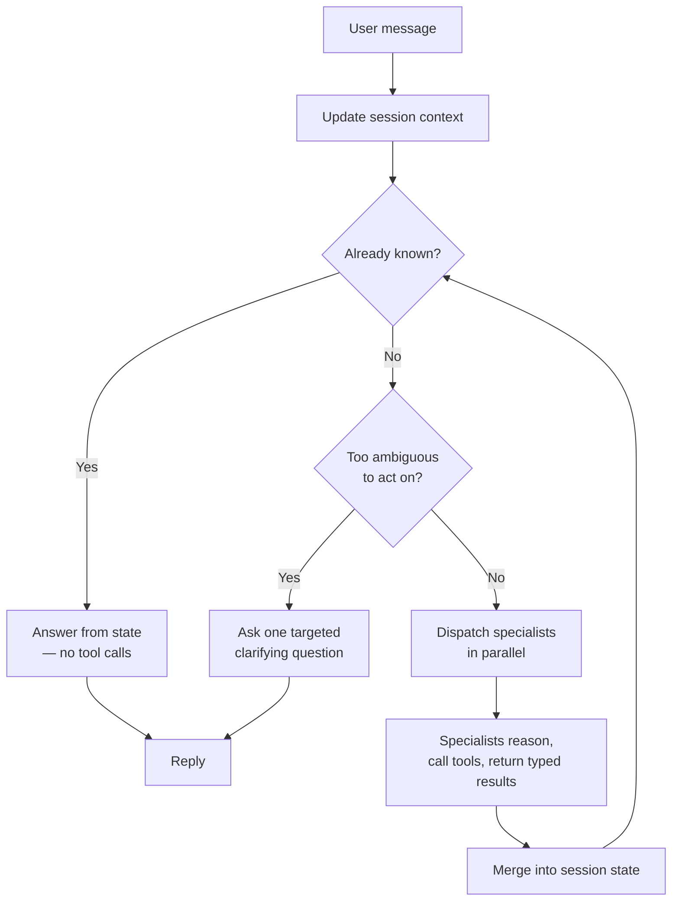
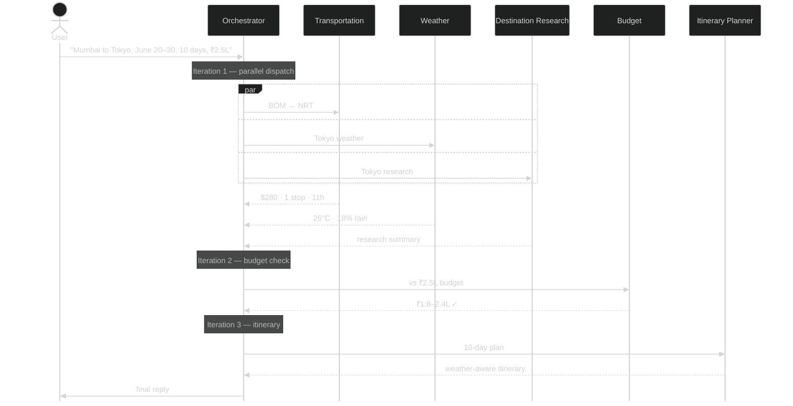

<div align="center">

# TravelAgent

**Agentic AI that plans real trips — flights, weather, budget, and day-by-day itineraries — through natural conversation.**


[See It In Action](#see-it-in-action) · [Architecture](#architecture) · [Quick Start](#quick-start)

> **TODO (hero visual):** a 15–30s looping GIF or embedded video of a real session — e.g. "Mumbai to Tokyo, June 20–30, ₹2.5L" — showing the multi-turn conversation resolve into a generated itinerary. This is the single highest-leverage asset in the whole README; capture it from an actual terminal run, not a mockup.

</div>

## At a Glance

| | |
|---|---|
| **Evaluated, not vibes-checked** | 215 tests + 8 per-specialist eval suites — deterministic decision checks and LLM-as-judge quality scoring |
| **Model experimentation as a feature** | Swap models, providers, or reasoning effort per specialist via config — zero code changes |
| **Fails safe by design** | Every tool output is schema-validated before an LLM sees it; failures return typed errors with automatic retry, never a crash |
| **Source-attributed answers** | Every research claim, cost, and recommendation links back to where it came from |
| **Real APIs, not stubs** | Live flight prices, live forecasts, live exchange rates — no fixtures pretending to be a product |

## The Problem

Planning a real trip means juggling five moving, interdependent variables — where, when, how much, how to get there, what to do — where the answer to any one of them changes the right answer to the rest. That isn't a question with an answer sitting in a vector store; it's a problem that has to be worked, one decision at a time, revising course as real data comes in.

| | Typical travel chatbot | TravelAgent |
|---|---|---|
| **Data** | Training data — stale, unattributed | Live flights, weather, FX rates, web search |
| **Answer shape** | One-shot guess | Decomposed into sub-questions, solved step by step |
| **Changing constraints** | Starts over each message | Session state persists and revises across turns |
| **Interdependent decisions** | Destination, dates, and budget answered in isolation | Reconciled together — budget checked against real flight + destination costs |

## What Makes TravelAgent Agentic?

This isn't `user → prompt → LLM → response`. Every turn runs through a real decision loop that checks what it already knows, decides whether it can act, and only calls out to the world when it has to:



- **Planning & decomposition** — one message becomes the right set of specialist calls, not a fixed pipeline. *"Mumbai to Tokyo, June 20–30, ₹2.5L"* fires Transportation, Weather, and Destination Research together; refines with Budget and Itinerary once those land.
- **Dynamic tool selection** — the orchestrator picks from 7 specialists based on what's actually being asked, and calls the same one again mid-session if the question shifts.
- **Iterative retrieval, not blind re-fetching** — every specialist call is checked against what's already known first; only the missing piece is fetched.
- **State that survives the conversation** — constraints accumulate and get revised turn over turn, not reset on every message.
- **Failure as a first-class outcome** — a failed tool call comes back as a typed result the orchestrator can react to, not an exception that ends the turn.

**→ *Deep dive: Agent Architecture*** *(coming soon)*

## Architecture

> **TODO (hero diagram):** a clean, high-level system diagram — legible in ~10 seconds — showing: CLI → Orchestrator (holding `UserContext` + `KnowledgeState`) → the 7 specialists fanning out → their external tools/APIs at the edges (SerpApi, Open-Meteo, Tavily, Frankfurter) → results flowing back through `KnowledgeState`. This is the hero technical asset of the README — worth commissioning as a real designed graphic rather than a code-generated flowchart.

- **Specialists are isolated, not shared context** — each one runs its own system prompt, tool set, and conversation history. Raw API responses never reach the orchestrator; it only ever sees structured summaries.
- **Every specialist is a wrapper, not a direct call** — the orchestrator never touches an external API itself. Each wrapper checks existing state first, invokes the specialist only for what's missing, writes results back, and turns failures into a message the orchestrator can react to instead of a crash.
- **State is two-tier, and ownership is scoped, not shared** — `UserContext` (free-text, conversational) belongs solely to the Orchestrator. `KnowledgeState` (typed, structured) belongs to the specialists: each writes only the slice it's responsible for — weather writes weather, budget writes budget — through typed update methods, never free-form. The Orchestrator only ever reads a compact overview of it.
- **Grounding isn't one retrieval step bolted in front — it's built into every specialist's own tools.** Web search for research and visas, live flight search for routes, live forecasts for weather, live rates for currency: each specialist reaches for its source of truth mid-reasoning, as needed, rather than the system fetching everything up front and hoping it's relevant.
- **The reliability boundary sits at the tool call** — every tool returns a typed result or a typed error, never an exception. That's the one contract all 8 agents and every external integration are held to.

**→ *Deep dive: Architecture & Design Decisions*** *(coming soon)*

## See It In Action

> **TODO (demo video):** a 1–3 minute screen recording of a real, non-trivial session — the trace below is a good candidate, or something with an even more visible mid-conversation pivot. Should show actual latency and actual tool output, not a cut-together highlight reel.

**Trace: "Mumbai to Tokyo, June 20–30, 10 days, ₹2.5L"** — specific enough to act on immediately, no clarifying question needed.



**What happened:** one message, three independent unknowns fired at once (route, weather, destination) instead of asked one at a time. Budget didn't run until real flight and destination numbers existed to check it against. The itinerary didn't run until the weather was known — so it could route around a rainy day 4 with an indoor alternative, not guess. Three ReAct iterations, one reply.

**→ *Deep dive: Example Agent Trajectory*** *(coming soon)*

## Evaluation

Unit tests check that the code runs. Evaluation checks that the agent *decides* correctly — the right tool, the right arguments, the right call to make given what it already knows.

| | Assertion-based | LLM-as-judge |
|---|---|---|
| **Checks** | Tool calls, arguments, mode/decision correctness | Output quality — accuracy, completeness, distinctness |
| **Verdict** | Pass / fail | Pass / fail + critique |
| **Runs** | CI-friendly — deterministic, no judge cost | On demand — before release, after a prompt change |

> **TODO (evaluation chart):** a model × reasoning-effort comparison across quality, cost, and latency, run across all suites — the basis for a concrete "model X had the best quality, but model Y had the best quality/cost/latency tradeoff → production config Z" conclusion. Current runs are per-specialist, single-model pass/fail checks; a full comparison run is queued.

> **TODO (test coverage table):** a table or diagram breaking down test count by kind (unit / assertion-eval / LLM-as-judge) per specialist and the orchestrator — what's covered, what isn't yet.

**→ *Deep dive: Evaluation Methodology*** *(coming soon)*
**→ *Deep dive: Model & Reasoning Experiments*** *(coming soon)*

## Production Thinking

**Reliability**
- Typed result/error contract at every tool call (see [Architecture](#architecture))
- Orchestrator suite includes error-injection tests — wrapper tools patched to fail on demand, verifying graceful degradation rather than a crash

**Performance**
- Parallel tool execution — the same ReAct harness parallelizes independent calls at every level: the orchestrator dispatching specialists, and a specialist dispatching its own tools (e.g. Weather fetching multiple date ranges at once)
- Bounded iteration cap (3–10, tuned per specialist) + per-specialist timeout — a stuck reasoning loop fails closed instead of running away on cost or latency

**Safety**
- `KnowledgeState` writes are typed and scoped per specialist — no free-form field, so one specialist can't corrupt another's slice of state
- *TODO — prompt-injection handling and input-boundary hardening not yet implemented*

**→ *Deep dive: Reliability & Failure Modes*** *(coming soon)*
**→ *Deep dive: Observability & Performance*** *(coming soon)*

## Engineering Decisions

**ReAct orchestrator loop, not a fixed pipeline**
> **Why:** real requests are partial, arrive in any order, and shift mid-conversation — a fixed sequence can't skip what's already known or ask for what's still missing.
> **Tradeoff:** harder to exhaustively test every path than a pipeline guarantees by construction.

**Two-tier state with split ownership**
> **Why:** `UserContext` (free-text, Orchestrator-owned) and `KnowledgeState` (typed, per-specialist-owned slices) mean no single component has to understand every other specialist's domain well enough to write into it correctly.
> **Tradeoff:** more classes and typed update methods to maintain than one shared mutable object.

**Wrapper-tool indirection over direct specialist calls**
> **Why:** every specialist runs through a wrapper — cache-check, invoke, write-back, typed error — so a specialist failure always comes back as data the orchestrator can react to, never an exception that ends the turn.
> **Tradeoff:** an extra layer of boilerplate to write and keep in sync for every specialist.

**Grounding owned per-specialist, not one central RAG stage**
> **Why:** each specialist's tools (flight search, weather, web search, currency) stay scoped to its own domain and edge cases, so prompts stay compact and focused — instead of one orchestrator prompt trying to reason about flights, weather, budget, and visas all at once.
> **Tradeoff:** no shared retrieval cache across specialists — overlapping facts get fetched independently instead of looked up once.

**Dual evaluation methodology**
> **Why:** assertion checks catch deterministic decision regressions cheaply in CI; LLM-as-judge catches semantic quality regressions assertions structurally can't express.
> **Tradeoff:** judge runs cost money and time per run, and are only as trustworthy as the judge model itself.

**→ *Deep dive: Design Decisions & Tradeoffs*** *(coming soon)*

## Tech Stack

| | |
|---|---|
| **AI** | Hand-rolled ReAct agent loop · any OpenAI-compatible LLM — Claude, GPT, local Ollama models |
| **Backend** | Python 3.13 · httpx · Pydantic + pydantic-settings |
| **Grounding** | SerpApi (flights) · Open-Meteo (weather & climate) · Tavily (web search) · Frankfurter (currency) |
| **Evaluation** | pytest · custom assertion + LLM-as-judge harness |
| **Interface** | CLI — argparse + Rich |

## Quick Start

**Prerequisites:** Python 3.13 · API keys for an LLM provider, [SerpApi](https://serpapi.com), and [Tavily](https://tavily.com) — Open-Meteo and Frankfurter need no key.

```bash
git clone https://github.com/harshb2000/TravelAgent.git && cd TravelAgent
python3.13 -m venv .venv && source .venv/bin/activate
pip install -r src/requirements.txt

cp src/.env.example src/.env   # add LLM_API_KEY, SERPAPI_API_KEY, TAVILY_API_KEY

python src/main.py
```

Run a specialist's eval suite:
```bash
cd src && python eval/weather_specialist.py
```
